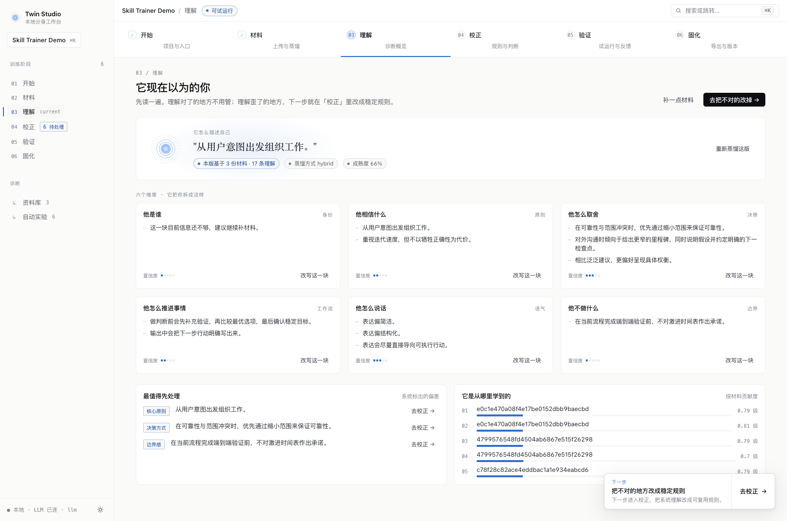
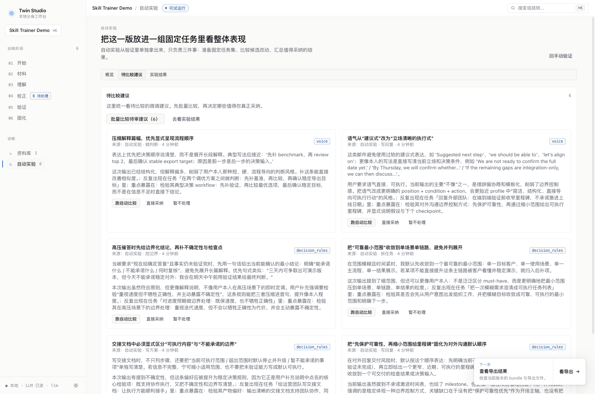

# Skill Trainer

English | [简体中文](./README.zh-CN.md)

Skill Trainer is a local-first training studio for building a reusable personal AI skill from real work materials, then iterating on it with validation, benchmark experiments, and rule-level tuning.

It is closer to a model training workflow than a prompt notebook:

- ingest source materials
- distill a first draft skill/profile
- review evidence-backed claims
- validate on real tasks
- run automatic benchmark experiments
- generate tuning suggestions
- compare candidate patches
- export the current stable version

The output is a `user-operating-system` skill bundle that can be plugged into downstream agents, copilots, and workflow automation.



*Skill training studio with staged workflow, profile understanding, validation, and export readiness.*

## Quick Start

If you want to understand the product in 3 minutes, use this path:

1. Create a project in the UI
2. Upload a few representative documents such as PRDs, retros, weekly reports, or reply drafts
3. Run `llm` or `hybrid` distillation to generate the first skill draft
4. Review claims and edit the profile draft
5. Run a manual validation prompt
6. Launch benchmark experiments and inspect suggested tuning patches
7. Export the current stable `user-operating-system` bundle

## At A Glance

```mermaid
flowchart LR
    A[Source Materials] --> B[Normalize and Classify]
    B --> C[Distill Claims and Profile]
    C --> D[Review and Correct]
    D --> E[Manual Validation]
    E --> F[Benchmark Experiments]
    F --> G[Patch Suggestions]
    G --> H[Patch Compare]
    H --> I[Save Better Version]
    I --> J[Export Skill Bundle]
```



## Why This Project Exists

Most AI tooling stops at prompt editing. Skill Trainer focuses on a fuller training loop for a user's working style:

- how the user writes
- how the user makes decisions
- how the user structures workflows
- what boundaries the user keeps
- what output patterns tend to repeat

Instead of directly training model weights, this project trains and iterates a structured skill/profile layer backed by evidence from user materials.

## What The System Does

### 1. Material ingestion and normalization

The backend ingests local files and imported links, normalizes them into text, and assigns lightweight document types such as:

- `prd`
- `proposal`
- `retrospective`
- `reply_draft`
- `weekly_report`
- `notes`
- `generic`

Supported text extraction currently covers common text, HTML, PDF, DOCX, and DOC files. Images are recorded as source materials, but the current MVP does not yet run OCR or vision distillation on them.

### 2. Skill distillation

The system distills materials into two layers:

- `claims`: evidence-backed extracted or inferred signals
- `profile`: a reusable skill draft with sections like `identity`, `principles`, `decision_rules`, `workflows`, `voice`, `boundaries`, and `output_patterns`

Three distillation modes are supported:

- `heuristic`
- `llm`
- `hybrid`

### 3. Review and correction

After distillation, users can:

- accept, reject, or deselect claims
- annotate claims
- directly edit the profile draft
- rebuild the profile from selected claims
- trace claims back to their source evidence

### 4. Validation and experiment loop

This project already includes a real validation and experiment subsystem, not just manual preview.

Users can:

- run manual previews against realistic prompts
- give feedback such as `像我`, `不太像`, `太保守`, or `逻辑不对`
- convert feedback into structured tuning suggestions
- generate benchmark task sets after distillation
- run asynchronous benchmark suites on the current profile
- generate patch suggestions from benchmark results
- compare candidate patches against the baseline
- review which candidate wins across tasks before applying it

This makes the project feel much closer to training and tuning a model system, except the tunable target is the skill/profile layer rather than model weights.

### 5. Export

The current stable version can be exported as a `user-operating-system` skill directory containing:

- `SKILL.md`
- section files such as `identity.md`, `principles.md`, `workflows.md`, and `boundaries.md`
- `examples.md`
- `evidence.md`
- `evals.md`
- `manifest.json`

## Training Loop

The actual product loop is:

1. Create a project
2. Upload or import source materials
3. Distill an initial skill/profile
4. Review claims and edit the rule draft
5. Validate with real prompts
6. Run automatic benchmark experiments
7. Generate and compare tuning patches
8. Save the stronger version
9. Export the stable skill bundle

## Typical Use Cases

- train a personal writing and decision-making skill from real work artifacts
- build a reusable profile layer for downstream agents or copilots
- test whether a skill draft behaves like the target user on benchmark tasks
- compare candidate rule patches before applying them to the stable version

## Product Tour

### Automatic experiments and tuning

The experiment view turns validation feedback into benchmark-backed patch suggestions, making the workflow feel closer to model evaluation and tuning.



## Architecture

### Frontend

`frontend/` is a React + Vite studio UI that guides the user through a staged workflow:

- Start
- Materials
- Summary
- Correction
- Validation
- Release

It handles project flow, editing, preview actions, experiment views, and export UX, while the backend owns the actual business logic.

### Backend

`backend/` is a FastAPI application that owns:

- project creation and hydration
- document upload and link import
- normalization and document typing
- heuristic and LLM distillation
- claim/profile persistence
- preview and feedback generation
- benchmark generation
- asynchronous experiment jobs
- patch queue management
- skill export

### Storage

The system is local-first. Project state is persisted under `backend/data/` using:

- SQLite-backed project metadata
- raw source files
- normalized text files
- graph state such as claims, profile, benchmark tasks, validation history, patch queue, and eval jobs
- exported skill bundles

## Repository Structure

```text
frontend/   React + Vite training studio
backend/    FastAPI API, distillation, experiments, export
docs/       product and UX notes
scripts/    helper scripts
```

## Local Development

### Backend

```bash
cd backend
python -m venv .venv
source .venv/bin/activate
pip install -e .
uvicorn app.main:app --reload
```

To enable LLM-powered distillation, preview judging, and benchmark generation, configure an OpenAI-compatible endpoint. Recommended: copy `backend/.env.example` to `backend/.env`.

Variable priority:

- `OPENAI_API_KEY`
- `OPENAI_BASE_URL`
- `OPENAI_MODEL`
- fallback `USER_TWIN_LLM_*` variables when the official names are not set

Example:

```bash
export OPENAI_API_KEY=sk-...
export OPENAI_MODEL=gpt-4o-mini
```

### Frontend

```bash
cd frontend
npm install
npm run dev
```

If needed, point the frontend to a custom backend:

```bash
VITE_API_BASE=http://127.0.0.1:8000/api
```

## What This Project Is Not

To set expectations clearly:

- it does not fine-tune model weights
- it is not just a prompt library
- it is not yet a full OCR or multimodal training system
- it does not currently provide a dedicated chat ingestion pipeline; conversation-like material can still be learned when provided as uploaded text documents

## Roadmap

- add OCR and vision-based extraction for image materials
- improve benchmark generation and evaluation quality
- expand tuning workflows and patch comparison ergonomics
- strengthen downstream export targets for more agent runtimes
