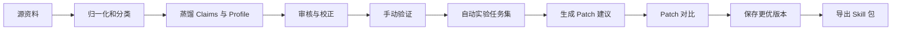

# Skill Trainer

[English](./README.md) | 简体中文

Skill Trainer 是一个本地优先的个人 AI skill 训练工作台。它不是单纯的 prompt 管理器，而是一个围绕「资料学习 -> skill 蒸馏 -> 验证 -> 自动实验 -> 规则调优 -> 导出」展开的完整训练闭环。

它更接近“训练一个可复用的个人能力层”，而不是只写一段提示词：

- 导入真实资料
- 蒸馏第一版 skill / profile
- 审核证据型 claims
- 用真实任务验证
- 跑自动实验任务集
- 生成微调建议
- 比较候选 patch
- 导出当前稳定版本

最终产物是一个 `user-operating-system` skill 包，可以接到下游 agent、copilot 或自动化系统中使用。


*一个围绕分阶段训练、理解、验证与导出的 skill 训练工作台。*

## Quick Start

如果你想在 3 分钟内理解这个产品，建议直接按这条路径走：

1. 在 UI 里创建一个项目
2. 上传几份最能代表你的资料，比如 PRD、复盘、周报、回复草稿
3. 运行 `llm` 或 `hybrid` 蒸馏，生成第一版 skill 草稿
4. 审核 claims，并编辑 profile 规则草稿
5. 用一个真实任务做手动验证
6. 启动自动实验，查看生成的微调 patch 建议
7. 导出当前稳定的 `user-operating-system` skill 包

## 一图看懂



## 为什么这个项目不只是 README 里说的“蒸馏工具”

这个项目真正做的事情，是把用户的工作风格训练成一个可迭代的规则层，包括：

- 用户怎么表达
- 用户怎么判断
- 用户怎么拆解和推进工作
- 用户的边界和克制方式
- 用户常见的输出结构

这里训练的不是模型权重，而是一个可以持续验证、持续修正、持续导出的 skill / profile 系统。

## 系统实际能力

### 1. 资料导入与归一化

后端支持本地文件上传和链接导入，并把资料统一归一化成文本，再做轻量资料类型识别，例如：

- `prd`
- `proposal`
- `retrospective`
- `reply_draft`
- `weekly_report`
- `notes`
- `generic`

当前文本提取已覆盖常见文本文件、HTML、PDF、DOCX、DOC 等格式。图片资料目前会被记录为资料来源，但当前 MVP 还没有接入 OCR 或视觉蒸馏。

### 2. Skill 蒸馏

系统会把资料蒸馏成两层：

- `claims`：带证据的抽取或推断信号
- `profile`：可复用的 skill 草稿，包含 `identity`、`principles`、`decision_rules`、`workflows`、`voice`、`boundaries`、`output_patterns` 等区块

支持三种蒸馏模式：

- `heuristic`
- `llm`
- `hybrid`

### 3. 审核与校正

蒸馏后，用户可以继续做：

- 接受、拒绝、取消导出某条 claim
- 给 claim 添加备注
- 直接编辑 profile 规则草稿
- 基于已选 claims 重新生成 profile
- 按证据回看来源文本

### 4. 验证、自动实验与调优

这是这个项目非常关键、但之前 README 没写准的一部分。

它不只是支持“手动试一下”，而是已经包含一整套验证和自动实验子系统。你可以：

- 用真实 prompt 做手动验证
- 对输出打反馈：`像我`、`不太像`、`太保守`、`逻辑不对`
- 把反馈转成结构化微调建议
- 在蒸馏后生成自动实验任务集
- 异步跑完整 benchmark 套件
- 基于 benchmark 结果生成 patch 建议池
- 把候选 patch 与当前 baseline 做自动对比
- 在多任务结果里看哪个候选版本更好，再决定是否采纳

所以它很像模型训练里的“评测集 + 调参 + 对比实验”流程，只不过这里被训练和迭代的是 skill / profile 规则层，而不是底层模型参数。

### 5. 导出

当前稳定版本可以导出为一个 `user-operating-system` skill 目录，包含：

- `SKILL.md`
- `identity.md`
- `principles.md`
- `decision-rules.md`
- `workflows.md`
- `voice.md`
- `boundaries.md`
- `output-patterns.md`
- `examples.md`
- `evidence.md`
- `evals.md`
- `manifest.json`

## 训练闭环

这个项目的真实主链路是：

1. 创建项目
2. 上传或导入资料
3. 蒸馏第一版 skill / profile
4. 审核 claims，编辑规则草稿
5. 用真实任务手动验证
6. 跑自动实验任务集
7. 生成并比较微调 patch
8. 保存更强的一版规则
9. 导出当前稳定 skill

## 典型使用场景

- 用真实工作资料训练一个更像“自己”的个人能力层
- 为下游 agent 或 copilot 生成可复用的 profile / rule 层
- 在 benchmark 任务集上验证当前 skill 草稿是否稳定
- 在正式采纳前，对候选规则 patch 做对比实验

## 产品界面

### 自动实验与调优

自动实验页会把验证反馈整理成基于 benchmark 的 patch 建议，让整个流程更像模型评测与调优，而不是单次 prompt 修改。


## 架构概览

### Frontend

`frontend/` 是 React + Vite 工作台，负责把整个训练过程组织成阶段式体验：

- 开始
- 材料
- 理解
- 校正
- 验证
- 固化

前端负责流程引导、编辑体验、预览和实验界面；真正的业务逻辑在后端。

### Backend

`backend/` 是 FastAPI 服务，负责：

- 项目创建和项目状态加载
- 文件上传与链接导入
- 资料归一化和文档类型识别
- 启发式与 LLM 蒸馏
- claims / profile 持久化
- 预览与反馈建议生成
- benchmark 任务生成
- 自动实验异步执行
- patch 建议池管理
- skill 导出

### Storage

系统是本地优先的，项目状态保存在 `backend/data/` 下，包括：

- SQLite 项目元数据
- 原始资料文件
- 归一化文本
- graph 状态，如 claims、profile、benchmark tasks、validation history、patch queue、eval jobs
- 导出的 skill 包

## 仓库结构

```text
frontend/   React + Vite 训练工作台
backend/    FastAPI API、蒸馏、实验、导出
docs/       产品与交互设计文档
scripts/    辅助脚本
```

## 本地运行

### Backend

```bash
cd backend
python -m venv .venv
source .venv/bin/activate
pip install -e .
uvicorn app.main:app --reload
```

如需启用基于 LLM 的蒸馏、预览评判和 benchmark 生成，请配置 OpenAI 兼容接口。推荐复制 `backend/.env.example` 为 `backend/.env`。

变量优先级：

- `OPENAI_API_KEY`
- `OPENAI_BASE_URL`
- `OPENAI_MODEL`
- 若官方变量未设置，则回退使用 `USER_TWIN_LLM_*`

例如：

```bash
export OPENAI_API_KEY=sk-...
export OPENAI_MODEL=gpt-4o-mini
```

### Frontend

```bash
cd frontend
npm install
npm run dev
```

如需自定义前端 API 地址：

```bash
VITE_API_BASE=http://127.0.0.1:8000/api
```

## 这个项目目前不是什么

为了避免误解，当前版本还不是：

- 不是模型权重微调系统
- 不是单纯的 prompt 库
- 不是已经完成 OCR / 多模态训练的系统
- 不是带有专门聊天接入管道的系统；如果要学习聊天风格，当前更适合通过文本文件形式导入对话资料

## 后续方向

- 接入 OCR 与视觉提取，让图片资料真正进入训练闭环
- 提升 benchmark 任务生成和评测质量
- 继续增强 patch 调优和对比实验体验
- 扩展更多下游 agent / runtime 的导出适配
